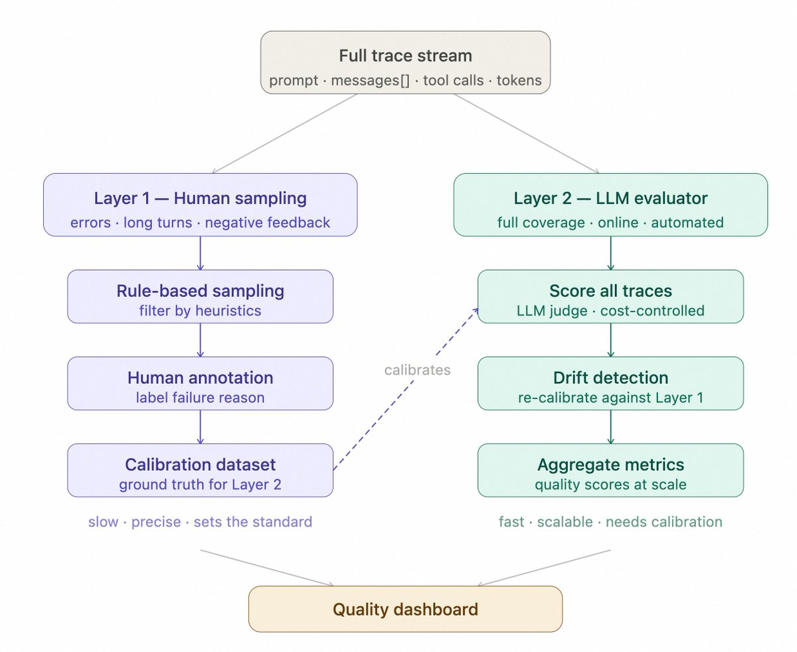

## agent evals:  from https://www.anthropic.com/engineering/demystifying-evals-for-ai-agents

Agent evaluation should measure both whether the agent succeeded and how it behaved while reaching the result.

*(missing diagram — not exported from Notion)*

#### **Components of Agent Evaluation:**

*(missing diagram — not exported from Notion)*

1. Task, Trial, and Grader

- **Task:** defines what the agent must do, a single test with defined inputs and success criteria.
- **Trial:** Each attempt at a task is a **trial**. Because model outputs vary between runs, we run multiple trials to produce more consistent results. --  because agent behavior is non-deterministic
- **Grader:** evaluates a specific aspect of performance, such as correctness, tool use, policy compliance, or efficiency. A single task may use several graders, including deterministic tests, state checks, tool-call checks, and LLM-based rubrics.

2. Trajectory and Outcome https://docs.langchain.com/langsmith/trajectory-evals

- **Trajectory/Trace/ Transcript:** is the complete record of a trial, including outputs, tool calls, reasoning, intermediate results, and any other interactions.
- **Outcome:** is the final state in the environment at the end of the trial

Both matter because they answer different questions:

```
Outcome: Did the agent achieve the goal?
Trajectory: Did it achieve the goal in an acceptable way?
```

2 situations: An agent may reach the correct outcome through unsafe or inefficient behavior. Conversely, it may follow a reasonable process but fail because of an external tool or environment issue.

Anthropic recommends grading both the final environment state and the execution transcript. LangChain also supports trajectory evaluation based on the exact sequence of messages and tool calls. 

**3.** Agent Harness and Evaluation Harness

- **Agent harness:** the runtime system being evaluated, including the model, prompts, tools, routing, memory, and control loop.
- **Evaluation harness:** is the infrastructure that runs evals end-to-end. It provides instructions and tools, runs tasks concurrently, records all the steps, grades outputs, and aggregates results.

The evaluation harness should ideally treat the agent harness as the **system under test**

OpenAI similarly describes an agent eval as a prompt, a captured run containing traces and artifacts, a set of checks, and a comparable score.

4. **Evaluation Suite** — can be achieved by evals platform or customized pipelines 

Running the whole suite produces an overall view of system performance rather than relying on a single example. LangSmith uses the similar structure of a dataset, a target application, and evaluators, with repeated runs grouped into experiments.

Core Evaluation Flow

```
Evaluation suite
      ↓
Select a task
      ↓
Run the agent harness
      ↓
Capture trajectory + outcome
      ↓
Apply graders
      ↓
Aggregate scores and metrics
```

### 3 types of evaluator/graders:

1. Code evaluator: String matching, unit testing, structure comparison; highest certainty; suitable for tasks with clear answers. It is least likely to introduce noise due to poor design; they should be used preferentially when there is a clear correct answer.
    
    *(missing diagram — `Screenshot 2026-07-13 at 15.10.42.png` not exported from Notion)*
    
2. LLM  as a judge: Scoring according to scoring criteria, comparing two answers to select the best, and reaching consensus through voting among multiple models.
    
    *(missing diagram — `Screenshot 2026-07-13 at 15.11.43.png` not exported from Notion)*
    
3. Human evaluator: Expert sampling review, annotation and calibration; reliable but slow; suitable for establishing benchmarks. 
    
    *(missing diagram — `Screenshot 2026-07-13 at 15.11.54.png` not exported from Notion)*
    

### Scoring design:

For each task, scoring can be weighted (combined grader scores must hit a threshold), binary (all graders must pass), or a hybrid.

### Eval types: **Capability vs. regression evals**

**Capability or “quality” evals** ask, “What can this agent do well?”  — set a low pass rate

**Regression evals** ask, “Does the agent still handle all the tasks it used to?” and should have a nearly 100% pass rate. 

capability eval with high rate can become a regression eval so that it run continuously to catch any drift. Tasks that once measured “Can we do this at all?” then measure “Can we still do this reliably?”

### Eval different agents:

1. **Evaluating conversational agents:** 
    1. answer quality 
    2. latecy
    3. interaction quality: tone, did it finish in <10 turns (transcript constraint), ects.
    4. stress-test models through extended, adversarial conversations.
2. Eval coding agents - see webpage
3. **Evaluating research agents**
4. **Computer use agents**

### How to deal with **non-determinism in evaluations for agents?**

run a eval set multiple times instead of just one single time 

measure: how *often* (what proportion of the trials) an agent succeeds for a task.

Two metrics help capture this nuance:

pass@k for tools where one success matters, pass^k for agents where consistency is essential.

**pass@k** measures the likelihood that an agent gets at least one correct solution in *k* attempts. As *k* increases, pass@k score rises. A score of 50% pass@1 means that a model succeeds at half the tasks in the eval on its first try. Defining k value is based on the task type. 

**pass^k** measures the probability that *all k* trials succeed. As *k* increases, pass^k falls since demanding consistency across more trials is a harder bar to clear. If your agent has a 75% per-trial success rate and you run 3 trials, the probability of passing all three is (0.75)³ ≈ 42%. This metric especially matters for customer-facing agents where users expect reliable behavior every time.

*(missing diagram — not exported from Notion)*

### **Building an Agent Evaluation System from Scratch**

*(missing diagram — not exported from Notion)*

1. Define success before collecting more data.
2. **Start Small, but Start with Real Failures** 
    
    starting with a small, targeted set of realistic tasks(reviewed manually) rather than a large but noisy benchmark.
    
    20–50 real failure cases(user-reported failures)
    
3. Include Both Positive and Negative Cases in eval set 
    
    Positive examples test capability. Negative examples test restraint and boundary behavior.
    
    Without negative cases, the system may improve recall by simply taking the same action too often.
    
4. **Write unambiguous tasks with reference solutions**
    
    A good task is one where two domain experts would independently reach the same pass/fail verdict. Ambiguity in task specifications becomes noise in metrics. The same applies to criteria for model-based graders: vague rubrics produce inconsistent judgments.
    
5. Reset the Environment/state for Every Trial 
    
    Otherwise, one trial may affect the next, making an environment problem look like an agent failure. 
    
6. Choose the Simplest Reliable Grader
    - **Code-based graders** when correctness can be checked deterministically
    - **LLM graders** when semantic quality or judgment is required
    - **Human review** for ambiguous cases and grader calibration
    
    LLM judges can have systematic biases, so a human-labeled set should be used to compare and recalibrate them.
    
7. Read Traces, Not Only Scores
    
    Aggregate metrics tell you that performance changed, but they often do not tell you why.
    
    Regularly inspect complete trajectories to find:
    
    - grader bugs
    - unexpected tool use
    - environment contamination
    - successful outcomes reached through unsafe behavior
    - failures hidden by misleading aggregate scores
    
    LangChain recommends using manually reviewed traces both to create ground truth and to align automated evaluators with human judgment.
    
8. Keep Expanding the Evaluation Frontier — based on new use cases/ edge cased/ failure cases
    
    When pass rates approach 100%, the suite may be becoming saturated. That does not necessarily mean the agent has solved the real problem. It may mean the current tasks no longer expose its capability boundary.
    
    OpenAI recommends maintaining both a regression suite of known failures and a rolling discovery set containing new production failures. https://developers.openai.com/cookbook/examples/realtime_eval_guide
    
    ```markdown
    Collect real failures
            ↓
    Define clear success criteria
            ↓
    Build isolated tasks
            ↓
    Run repeated trials
            ↓
    Grade with code, models, and humans
            ↓
    Inspect traces
            ↓
    Add new failures and harder cases
    ```
    
    ## How to maintain eval system:
    
    1. Fix the Evaluation System Before Changing the Agent
    When an agent’s score drops, do not immediately assume the agent has become worse.
        
        The evaluation system may be producing a noisy or incorrect signal.
        
        Common causes include:
        
        - infrastructure failures, such as out-of-memory crashes or timeouts
        - grader bugs that mark correct outputs as failures
        - test cases that no longer reflect production usage
        - aggregate metrics hiding regressions in one task category
        
        LangChain’s evaluation checklist explicitly recommends ruling out infrastructure and data-pipeline issues before blaming the agent, and manually inspecting failed traces to verify grader fairnesshttps://www.langchain.com/blog/agent-evaluation-readiness-checklist OpenAI also notes that grading failures may come from system errors or bugs in the grading logic itselfhttps://developers.openai.com/api/docs/guides/reinforcement-fine-tuning
        
        Practical Debugging Order
        
        When an evaluation score drops:
        
        1. Check infrastructure errors, timeouts, and resource limits.
        2. Inspect failed traces and grader decisions.
        3. Check whether the failure is concentrated in one task category.
        4. Only then modify the model, prompt, tools, or agent logic.
    

**How evals fit with other methods for a holistic understanding of agents**

*(missing diagram — `Screenshot 2026-07-13 at 15.36.07.png` not exported from Notion)*

*(missing diagram — `Screenshot 2026-07-13 at 15.36.19.png` not exported from Notion)*

Traceability / Observability  for evals 

2 layers Observability  — can help to evaluator validation 

1.  manual sampling and labeling. Based on rules, it samples error cases, long dialogues, and negative user feedback. Humans judge the execution quality and reasons for failure, primarily to identify failure patterns and provide calibration data for the second layer.
2. LLM as a judge, providing full coverage of a wider range of traces. It uses the labeling results from the first layer as the calibration basis. Running only the second layer makes the scoring criteria prone to drift, while relying solely on the first layer doesn't cover real-world traffic on a large scale. Both layers must be used together.



#### **How to perform sampling in online evaluation?**

run online evaluation on 10% to 20% of traces, sampling according to rules rather than randomly:

1. Negative feedback triggering: Traces where users explicitly express dissatisfaction should be queued.
2. High-cost dialogues: Token consumption exceeding the threshold should be prioritized for review, often indicating the agent is circling around.
3. Time window sampling: Random sampling should be performed at fixed time intervals each day to maintain coverage of normal traffic.
4. After model or prompt changes: Full review should be conducted within the first 48 hours to confirm no degradation.

*(missing diagram — not exported from Notion)*

---

haven’t been organized: 

https://openai.com/index/trustworthy-third-party-evaluations-foundations/

### https://medium.com/data-science-collective/how-to-build-production-ready-ai-engineering-projects-3142a88f06ea

for some agents behavior: 

In Production agents

agents:

unit tests for individual tools, integration tests for complete workflows, and some adversarial testing to see what happens if a user asks something malicious.

https://nicktalwar.substack.com/p/6-things-your-ai-agents-need-that&publication_id=4575330&post_id=198444724&utm_campaign=email-post-title&isFreemail=true&r=2hym4d&triedRedirect=true&utm_medium=email

**1. Evaluation Frameworks**

This means building structured test suites that run against your agent’s outputs on a regular cadence, scoring for accuracy, relevance, and task completion across a range of realistic scenarios.

Good evaluation suites include both deterministic checks (did the agent call the right tool with the right parameters?) and judgment-based scoring (was the response actually useful to the person asking?).

evaluation has to be continuous, running in CI/CD pipelines and against live traffic — data drift over time 

Anthropic’s engineering team has written publicly about maintaining evaluation suites as living artifacts, with dedicated teams owning the infrastructure while domain experts contribute tasks and run the tests themselves.

**2. Fallback and Escalation Logic**

Fallback logic defines the boundaries.  Escalation logic layers on top of that by adding severity awareness.

The organizations successfully scaling agents build these paths before deployment, treating them as load-bearing architecture.

**3. Monitoring for Drift**

Potential reasons: Model updates, shifts in input data, changes to upstream APIs, seasonal variation in user behavior.

Drift monitoring tracks the gap between how your agent performed when you validated it and how it performs now.

In practice, effective drift detection requires capturing baseline metrics during your evaluation phase and then running the same scoring pipeline against production traffic on an ongoing basis. When scores diverge from your baseline by more than an acceptable margin, you have a concrete signal to investigate 

**4. Human-in-the-Loop Checkpoints**

Human-in-the-loop checkpoints create structured moments where a person reviews, approves, or redirects agent output before it reaches the end user or triggers a downstream action.

As agents take on more complex workflows, these checkpoints also become your training data pipeline. Every human correction is a signal about where the agent needs improvement, but only if you’re logging it (which brings us to the next point).

**5. Logging for Auditability — LangSmith / Langfuse** 

Full execution logging captures the chain of reasoning, tool invocations, retrieved context, intermediate outputs, and final actions across every run.

three purposes:

debugging 

compliance

improvement 

**6. A Defined Handoff Protocol**

Every one of those transitions(btw agents/ btw agents & user) is a potential failure point.

A handoff protocol specifies what information transfers with the task, what context the receiving party needs, what constitutes a successful handoff versus a dropped one, and who owns the outcome after the transition.

**The Management Layer You Can’t Skip**

The agent itself, the model, the prompts, the tool integrations, that’s maybe 40% of what a production deployment actually requires.

The other 60% is the system that keeps the agent honest, visible, and recoverable when things go sideways.

Organizations that treat agent deployment as a build-and-ship exercise will spend the next six months doing manual cleanup on failures they could have prevented. The ones that invest in this management layer first will find that their agents get better over time instead of quietly getting worse.
