# RAG Evaluation Gates

This is the ownership contract for the support-agent RAG system. It defines what each stage must prove, which artifact it hands to the next stage, and how the eval story report should turn the evidence into stakeholder recommendations.

The central rule: do not collapse corpus quality, retrieval ranking, agent behavior, answer generation, and grader calibration into one score. Each gate answers a different question and must preserve its row pool, config, and failure labels for downstream interpretation.

## Gate → Pipeline Mapping

The gate structure is conceptual (ownership + questions), not a CLI structure. Each gate maps to existing pipeline commands and notebooks — do not rename pipelines to `gate-N` names.

| Gate | Question | Pipeline / entry point | Notebook context |
|------|----------|------------------------|------------------|
| 1 — Corpus QA | Is the corpus valid? | `evals.pipelines.validate_data_contract` | `nbks/baseline/01_gt_verification.ipynb` |
| 2 — Index Readiness | Does the index represent the corpus? | notebook only (local embed cache) | `nbks/baseline/02_corpus_ingestion_quality.ipynb` |
| 3 — Retrieval Optimization | Which config finds the right evidence? | `evals/data/rag_url_qa/compare_agents/plot_gate_figures.py` | `nbks/baseline/03_retrieval_optimization.ipynb` |
| 4 — Model / Runtime | Which model to evaluate on? | `evals.pipelines.build_agent_comparison` | `nbks/baseline/04_unified_retrieval_comparison.ipynb` |
| 5 — Agent Retrieval | Do agent features improve source selection? | `evals.pipelines.build_agent_comparison` + `plot_gate_figures.py` | `nbks/baseline/04_unified_retrieval_comparison.ipynb` |
| 6 — Generation Quality | Did the answer use evidence correctly? | `evals.pipelines.run quality` → `eval_quality.py` | — |
| 7 — Grader Calibration | Do graders match user outcomes? | `evals/reports/html/calibration_report.py` | `nbks/mvp/02_llm_callibration.ipynb` |
| 8 — Report / Handoff | What should stakeholders do next? | `evals.pipelines.run render` → `eval_story.py` | — |

Result caches (embeddings, retrieval sweep JSONs) live in `data/retrieval_experiments/` — gitignored, local-only.

## Gate Ladder

```mermaid
flowchart LR
  sourceData[Source Data] --> corpusGate[Gate 1: Corpus QA]
  corpusGate --> indexGate[Gate 2: Index Readiness]
  indexGate --> retrievalGate[Gate 3: Retrieval Optimization]
  retrievalGate --> modelGate[Gate 4: Model And Runtime]
  modelGate --> agentGate[Gate 5: Agent Retrieval]
  agentGate --> generationGate[Gate 6: Generation Quality]
  generationGate --> calibrationGate[Gate 7: Grader Calibration]
  calibrationGate --> reportGate[Gate 8: Report Recommendation]
```



## Common Handoff Contract

Every gate must emit enough evidence for the next owner to proceed without reverse-engineering upstream state.

- Input contract: named row pool, artifact paths, run ID, git commit, config snapshot, timestamp, and known exclusions.
- Output contract: pass/fail status, metric summary, row-level diagnostics, failure taxonomy labels, and recommended next action.
- Compliance rule: a downstream gate must not silently score rows that the upstream gate marked ineligible. Ineligible rows can appear only as a separate diagnostic slice.
- Report rule: every stakeholder-facing claim should name the gate, row pool, sample size, and source artifact behind it.

## Canonical Row Pools

- `all_gt`: every golden-trace row, including rows that are useful for demand analysis but not fair for retrieval scoring.
- `source_mapped_gt`: rows whose expected URLs can be resolved to a known groundable source or alias.
- `retrieval_eligible_gt`: mapped rows whose expected source is present in the indexed corpus.
- `generation_eligible_gt`: rows where at least one approved retrieval backend returns an expected URL or alias in top-k.
- `quality_sample`: deterministic, cost-capped sample used for LLM grading. It must preserve eligibility labels so answer-quality scores are not confused with retrieval misses.

## Failure Taxonomy

Use stable labels so notebooks, pipelines, and reports can aggregate failure modes consistently.

- `source_missing`: expected source is absent from the source corpus.
- `url_unmapped`: expected URL cannot be matched to a canonical source or alias.
- `topic_proxy`: source is useful for topic coverage but not groundable as an answer citation, for example Billypedia.
- `index_lag`: source exists in corpus but not in the vector index.
- `chunk_fragmented`: source is indexed, but relevant evidence is split or too thin for ranking/generation.
- `rank_miss`: expected source is indexed but not returned in top-k.
- `query_rewrite_miss`: generated/reformulated query loses the user intent.
- `reranker_regression`: reranker demotes an otherwise correct candidate.
- `context_missing`: passage-required grader received URLs or empty context instead of article text.
- `citation_hallucination`: final answer cites a URL outside the retrieved set.
- `unsupported_claim`: answer makes a claim not grounded in retrieved passages.
- `incomplete_answer`: answer misses a required sub-question or action.
- `wrong_escalation`: agent escalates when it should answer, or answers when it should escalate.

## Gate 1: Corpus QA

Question: is the source corpus valid enough to index?

Track:

- Source inventory by `source_type`, domain, language, market, freshness flag, and source owner.
- URL validity and Billy/Shine alias-map coverage.
- Exact duplicate and duplicate URL rates.
- Content quality: title coverage, metadata coverage, too-short/too-long docs, HTML artifacts, encoding errors, language drift.
- Demand coverage: how many GT expected URLs map to corpus documents, separated from topic proxies.

Handoff to Gate 2:

- Processed corpus manifest.
- URL/alias coverage report.
- Source inventory and demand coverage by source type.
- Excluded rows with `source_missing`, `url_unmapped`, or `topic_proxy` labels.

Compliance check:

- Retrieval metrics must not include unmapped or source-missing rows except in a separate diagnostic slice.

## Gate 2: Index Readiness

Question: does the vector DB faithfully represent the approved corpus?

Track:

- Indexed document count vs processed corpus count.
- Chunk count by source type and document.
- Stable chunk ID coverage and checksum/idempotency behavior.
- Chunk health: short chunk rate, fragment rate, clean starts/ends, average chunk length, parent-child alignment for hierarchical chunking.
- Config snapshot: chunker, chunk size, overlap, embedding model, vector backend, index name, search strategy, score threshold, reranker settings.

Handoff to Gate 3:

- Index manifest.
- Chunk statistics.
- Embedding/index config.
- Source coverage by indexed chunk.
- Known risks such as `index_lag` or `chunk_fragmented`.

Compliance check:

- Every retrieval result must be traceable from retrieved URL/chunk back to corpus document and index config.

## Gate 3: Retrieval Optimization

Question: which retrieval configuration finds the right evidence before generation?

Evaluate only on `retrieval_eligible_gt` by default. Keep `source_mapped_gt` and `all_gt` as diagnostic views.

Track:

- Ranking metrics: MRR, P@1, R@3, R@5, NDCG@3, NDCG@5.
- Coverage metrics: hit@k, no-hit rate, duplicate URL rate, top-k source diversity.
- Slice metrics by source type, language, query length, difficulty, and GT confidence.
- Cost/latency: p50/p95 retrieval latency, backend calls, reranker latency, and local index build cost.
- Config dimensions: dense/sparse/hybrid, chunker, chunk size/overlap, top-k, threshold, reranker, source masks, Bedrock vs local.

Handoff to Gate 4:

- Recommended retrieval config and runner-up configs.
- Slice-level risks.
- Failure labels: `rank_miss`, `chunk_fragmented`, `query_rewrite_miss`, `reranker_regression`, `index_lag`.

Compliance check:

- Do not pick a winner from aggregate MRR alone. The recommendation must include row pool, sample size, source slices, and latency/cost.

## Gate 4: Model And Runtime Comparison

Question: which model/runtime should be evaluated on top of controlled retrieval evidence?

Expected artifact:

- `nbks/baseline/05_unified_retrieval_comparison.ipynb` should export JSON plus report-ready figures. If the notebook moves, keep the export contract stable.

Required export fields:

- Run metadata: run ID, git commit, created time, model name/version, prompt version, retrieval config, dataset, row pool, sample size.
- Metrics: calibrated pass rates, heuristic integrity rates, latency/cost, retry/tool-call counts, and failure taxonomy counts.
- Figures: model leaderboard, quality-vs-latency scatter, pass-rate bars, source-slice deltas, and failure taxonomy heatmap.

Handoff to Gate 5:

- Chosen model/runtime candidates.
- Model-specific query/citation risks.
- Approved figures for the eval story report.

Compliance check:

- A recommendation must state whether the model is better for retrieval behavior, generation quality, or latency/cost. Do not promote a model that improves end-to-end score while regressing source integrity.

## Gate 5: Agent Retrieval Behavior

Question: do agent-level retrieval features improve evidence selection in the real loop?

Track:

- Ranked metrics where retrieved URLs are available: MRR, P@1, R@3, R@5, NDCG@3, NDCG@5.
- Feature diagnostics: query variants, query count, retry count, CRAG confidence, relevance grades, reranker choices, backend, fallback path.
- Cost/latency: total latency, retrieval latency share, extra LLM calls, token cost.
- Feature deltas: CRAG on/off, single-query vs multi-query, reranker off/on, Bedrock vs local backend.

Handoff to Gate 6:

- Agent outputs with retrieved URLs, retrieved passages where possible, citations, final answer, feature flags, diagnostics, and latency/cost metadata.

Compliance check:

- Passage-required graders need passage text. If only URLs are available, emit `context_missing` and keep those scores out of hard promotion decisions.
- Cited URLs must be checked against retrieved URLs before answer quality is interpreted.

## Gate 6: Generation Quality

Question: did the final answer use retrieved evidence correctly and help the user?

Run on `quality_sample`, sliced by generation eligibility.

Track:

- Heuristic gates: citation hallucination, missing citation, citation recall, language consistency, F1 correctness, boundary adherence, failure patterns.
- Passage-required LLM gates: grounding, RAGAS context precision, RAGAS faithfulness.
- User-quality gates: answer relevancy, completeness, escalation alignment, EPA/conciseness where relevant.
- End-to-end integrity: cited source in retrieved set, expected source recall, unsupported claim rate, answer/no-answer appropriateness.

Handoff to Gate 7:

- Grader inputs/outputs with prompt versions, judge model versions, passage availability, row pool, user sentiment where available, and failure taxonomy labels.

Compliance check:

- Do not mix URL-only context with passage-text context in the same grounding/RAGAS pass-rate claim.

## Gate 7: Grader Calibration

Question: do the graders match user outcomes well enough to gate releases?

Track:

- Liked vs disliked score separation.
- Cohen's d and score delta.
- Precision, recall, and F1 against user sentiment.
- Pass-rate stability by query type, source type, language, difficulty, and model/runtime.
- Prompt and judge versions.

Handoff to Gate 8:

- Calibrated grader set and thresholds.
- Known unreliable/experimental graders.
- Confidence level by metric.
- Guidance on whether each metric is hard gate, tracking signal, or diagnostic only.

Compliance check:

- Experimental graders can inform investigation, but stakeholder recommendations must not use them as hard promotion evidence.

## Gate 8: Report And Recommendation

Question: what should stakeholders conclude, and what should the RAG owner do next?

The eval story report should explain:

- How to evaluate RAG: corpus eligibility, index readiness, retrieval ranking, generation quality, calibration.
- How to evaluate agents: separate retrieval feature effects from model/runtime effects and final answer quality.
- What is ready now: gate checks and figures backed by current artifacts.
- What is provisional: ablations still running, model-comparison figures not exported, Bedrock passage text missing, or low-sample slices.
- What to do next: recommendations by failure class, not just leaderboard rank.

Recommended report components:

- Gate ladder / methodology overview.
- Gate cards with pass/fail/readiness status.
- Leaderboards with row pool, sample size, source slices, latency/cost, and exclusions.
- `Ship`, `Hold`, `Investigate`, and `Needs data` recommendation cards.
- Figure slots for retrieval sweeps and `05` model comparison exports.

## Pipeline Checks To Add Or Maintain

- Validate notebook/export JSON before report rendering.
- Require run metadata, row pool, config snapshot, metric names, sample size, and failure labels.
- Warn on missing RAG optimization or model-comparison artifacts.
- Warn when passage-required graders receive missing passage text.
- Keep checks in existing `evals/pipelines` or `evals/reports` utilities; do not create new top-level `evals/` directories.

## Metric Registry

Use the metric names already implemented in `evals/metrics` and `evals/graders`. Do not invent report-only aliases unless they are display labels.

### Retrieval Metrics

Implemented in `evals/metrics/retrieval.py`:

- `mrr`: reciprocal rank of the first expected URL/alias.
- `p@1`, `p@3`, `p@5`: precision at k.
- `r@1`, `r@3`, `r@5`: expected URL recall at k.
- `f1@1`, `f1@3`, `f1@5`: harmonic mean of precision/recall at k.
- `ndcg@1`, `ndcg@3`, `ndcg@5`: rank-sensitive relevance at k.

These metrics are alias-aware through Billy/Shine URL expansion. They are valid only for retrieval-eligible or explicitly diagnostic row pools with known `expected_urls`.

### Heuristic Integrity Gates

Implemented in `evals/graders/registry.py` and thresholded in `evals/metrics/_constants.py`:

- `citation_hallucination`: threshold `0.95`; cited URLs must come from retrieved sources.
- `missing_citation`: threshold `0.90`; substantive responses should cite sources.
- `citation_recall` / `source_match`: threshold `0.50`; cited sources should match expected URLs.
- `language_consistency`: threshold `0.95`; Danish query should not drift to the wrong language.
- `f1_correctness`: threshold `0.70`; token-level correctness heuristic.
- `boundary_adherence`: threshold `0.80`; decline/escalation boundary heuristic.
- `retrieval_precision`: threshold `0.75`; citation-based retrieval proxy.
- `proxy_retrieval_recall`: threshold `0.65`; conservative retrieval recall proxy.

### Calibrated Quality Gates

Default calibrated tier in `evals/graders/registry.py`:

- `answer_relevancy_voted`: uses `answer_relevancy` threshold `0.75`.
- `completeness_voted`: uses `completeness` threshold `0.70`.
- `grounding_voted`: uses `grounding` threshold `0.60`; passage text required.
- `deepeval_answer_relevancy`: threshold `0.75`; tracking/cross-check.
- `ragas_context_precision_voted`: uses `ragas_context_precision` threshold `0.50`; passage text required.
- `ragas_faithfulness_voted`: uses `ragas_faithfulness` threshold `0.50`; passage text required.

Passage-required graders must receive `retrieved_passages`, not URL strings. If passage text is unavailable, label the row or run as `context_missing` and keep it out of hard release claims.

### Experimental Or Tracking Signals

- `epa`: threshold `0.65`.
- `conciseness`: threshold `0.70`.
- `agent_behavior`: threshold `0.80`.
- `intent`: threshold `0.70`.
- `source_fidelity`, `correctness`, `oos_boundary`: provisional thresholds; do not use for promotion until calibrated.

## Artifact Schemas

Every notebook/export artifact should include these common fields:

```json
{
  "run_id": "string",
  "created_at": "ISO-8601 timestamp",
  "git_commit": "short sha",
  "gate": "corpus_qa | index_readiness | retrieval_optimization | model_runtime | agent_retrieval | generation_quality | grader_calibration",
  "dataset": "path or dataset name",
  "row_pool": "all_gt | source_mapped_gt | retrieval_eligible_gt | generation_eligible_gt | quality_sample",
  "n": 0,
  "config": {},
  "metrics": {},
  "failure_counts": {},
  "known_exclusions": [],
  "pass": true
}
```

Gate-specific required fields:

- Corpus QA: `source_inventory`, `alias_coverage`, `duplicate_counts`, `content_quality`, `excluded_rows`.
- Index readiness: `index_manifest`, `chunk_stats`, `rag_config`, `source_coverage_by_chunk`, `chunk_record_schema_version`.
- Retrieval optimization: `retrieval_config`, `metrics` with `mrr` and `ndcg@k`, `slice_metrics`, `latency_ms`, `failure_counts`.
- Model/runtime comparison: `model_id`, `prompt_version`, `retrieval_config_id`, `quality_metrics`, `latency_ms`, `cost`, `figure_paths`.
- Agent retrieval behavior: `agent_id`, `feature_flags`, `retrieved_urls`, `retrieved_passages_available`, `retry_count`, `query_variant_count`.
- Generation quality: `grader_versions`, `passage_availability`, `heuristic_summary`, `calibrated_summary`, `context_missing_count`.
- Grader calibration: `grader_name`, `prompt_version`, `liked_mean`, `disliked_mean`, `cohens_d`, `precision`, `recall`, `f1`.

## Report Figure Contract

The eval story report should consume figures only after their source artifact is versioned.

- Retrieval optimization: top-config MRR bars, source-slice comparison, corpus-mask comparison, latency/quality tradeoff.
- `05_unified_retrieval_comparison.ipynb`: model leaderboard, quality-vs-latency scatter, model pass-rate bars, source-slice deltas, failure taxonomy heatmap.
- Generation quality: calibrated pass-rate bars, heuristic integrity gates, context-missing/passages-available split.
- Calibration: Cohen's d, threshold pass-rate chart, score distributions, prompt-version comparison.

## Testing Strategy

Run tests at the same layer as the change.

- Metric math and aliasing: `uv run pytest tests/unit_tests/test_evals/metrics/test_metrics.py -q`.
- Report artifact/schema handling: `uv run pytest tests/unit_tests/test_evals/reports/test_eval_story.py -q`.
- Report rendering without grader reruns: `uv run python -m evals.reports eval-story --output evals/reports/output/sa/sa_eval_story.html`.
- Python syntax for report helpers: `uv run python -m compileall evals/reports/ablation.py evals/reports/html/eval_story.py`.
- IDE/static feedback: run lints on edited report, metric, and test files.

When changing grader prompts or thresholds, add a calibration run before treating the metric as a hard gate. A threshold change without liked/disliked separation evidence is report-only commentary, not release policy.

## Operating Sequence

1. Run corpus audit and write the corpus manifest.
2. Export ingestion/index coverage and eligibility row pools.
3. Run retrieval sweep on eligible rows and export ranked metrics plus diagnostics.
4. Export `05` model comparison results and figures.
5. Run agent retrieval feature ablations using controlled retrieval/model candidates.
6. Run quality grading on the deterministic quality sample.
7. Refresh calibration summaries if graders or judge models changed.
8. Render the eval story report and publish recommendations with caveats.
