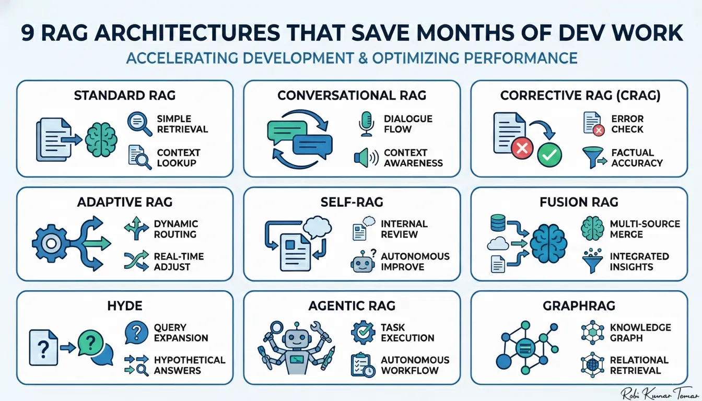

https://martinfowler.com/articles/reliable-llm-bayer.html?ref=dailydev

### **9 RAG Architectures**

https://pub.towardsai.net/9-rag-architectures-that-save-you-months-of-dev-work-0e219eb637cb

- Implement **Standard RAG** as your baseline, then prototype **one additional pattern** (CRAG for accuracy, Conversational for chat, Fusion for enterprise).
- Run the **A/B test plan** at the end to validate impact.

**1. Standard RAG - Retrieve top-k passages → inject into the prompt → generate.**

**2. Conversational RAG - Standard RAG augmented with dialogue state and query condensation.**

**3. Corrective RAG: Generate → extract claims → retrieve evidence → verify and rewrite.**

Pros: Reduces factual errors and produces evidence-backed answers.
Cons: Higher latency and cost.
Production tip: Build a robust claim extractor (rules + NER) and track claim-level precision.

**4. Adaptive RAG — route to fit intent**

Route queries to different retrieval and prompt pipelines based on detected intent or confidence.

**When to use:** Mixed workloads (FAQs, research queries, creative tasks).

**Pattern:** Intent classifier → select pipeline.

- **Fast path:** Low-k retrieval, cached or templated answers.
- **Deep path:** High-k retrieval, multi-hop or iterative retrieval with richer prompts.

**Production tip:** Keep the intent model small and inexpensive; ensure routing rules and policies are auditable.

**Takeaway:** **Adaptive RAG delivers speed for simple queries and depth where it truly matters.**

**5. Self-RAG — let the model propose search terms**

a model/agent to rewrite the questions/request the user sends: The LLM generates query expansions or keywords that are then used for retrieval.

**When to use:** Vague user inputs and domains with heavy paraphrasing.
**Guardrail:** Validate or constrain generated queries to prevent model-invented or out-of-scope terms

**6. Fusion RAG — multiple retrievers, one synthesizer**

Pull evidence from vectors, web search, and DBs → rerank → synthesize.

**When to use:** Enterprise systems that combine internal docs + web + DBs.

**Pattern:** Run vector search + web API + SQL → merge & rerank → LLM synthesize with provenance labels.

**Use Fusion when breadth of sources matters.**

**7. HyDE (Hypothetical Document Embeddings) — generate to retrieve**

Instead of searching with your raw question, HyDE first asks an LLM to *write a fake answer* to your question, then uses that fake answer to search for real documents.

Generate hypothetical Q/A pairs from documents, index their embeddings, and significantly boost recall.

**When to use:** 

- When your queries are **vague or short** and don't match well against your documents
- When your documents are **dense or technical** (research papers, manuals, etc.)

**The tradeoff:** It costs an extra LLM call before retrieval, so it's slightly slower and more expensive — but often significantly more accurate.

**Pattern:** Generate multiple Q/A variants per document → embed and index them → retrieve against user queries.

**Production tip:** Regenerate HyDE entries whenever models or source documents change.

**Takeaway:** **HyDE is a low-cost preprocessing technique that dramatically improves recall for paraphrase-heavy queries.**

**8. Agentic RAG — retrieval inside an agent loop**

Retrieval becomes a first-class tool in an agent’s planner → executor → verifier cycle.

**When to use:** Multi-step automation, research agents, and code-writing bots.

**Pattern:** Planner → (retriever as a tool) → executor → verifier, with the agent spawning sub-queries and iterating as needed.

**Production tip:** Sandbox tool execution and implement step-level rollbacks for safety and recovery.

**Takeaway:** **Agentic RAG moves you from Q&A to action — use it for automation-heavy products.**

**9. GraphRAG — vector retrieval + graph reasoning**

Combine vector retrieval with a knowledge graph to enable entity-driven, multi-hop reasoning.

**When to use:** Biotech, legal, and research domains where complex entity relationships and provenance are critical.

**Pattern:** Retrieve relevant passages → entity-link to graph nodes → perform graph traversal for multi-hop inference → synthesize with an LLM and surface the traversal path.

**Production tip:** Invest heavily in accurate entity-linking and a clear provenance UI.

**Takeaway:** **GraphRAG is the right choice when explainable, multi-hop answers with traceable provenance are non-negotiable.**

**Quick decision cheat-sheet**

- **Accuracy critical:** CRAG or GraphRAG.
- **Conversational:** Conversational RAG + condensation.
- **Mixed workload:** Adaptive or Fusion RAG.
- **Paraphrase-heavy / sparse docs:** HyDE or Self-RAG.
- **Automation / agents:** Agentic RAG.

**Monitoring & evaluation**

- **Hallucination rate** — % answers with at least one false claim (manual + automated).
- **Precision@k / Recall@k** — retrieval quality.
- **Latency (p95)** — critical for UX.
- **Cost / query** — tokens + API charges.
- **User trust score** — human-review pass rate or NPS.
- **Claim-level accuracy** — for CRAG systems.

**Packaging & production checklist**

- Semantic chunking with overlap; keep chunk sizes within prompt-window limits.
- Cross-encoder reranker for top-N retrieval results.
- Incremental embedding refresh for dynamic or frequently updated sources.
- Caching for high-frequency and repeat queries.
- Token-budget enforcement with summarization for long contexts.
- Snapshot, backup, and rebuild plan for the vector database.
- PII redaction pipeline and strict access controls for private data.
- Human-in-the-loop review for flagged outputs, with feedback loops for retraining or re-indexing.

**Context Augmentation in RAG**

Modular RAG- Transforming RAG Systems into LEGO-like Reconfigurable Frameworks.pdf

*(missing diagram — `Screenshot 2026-07-09 at 15.22.33.png` not exported from Notion)*

Retrieval-Augmented Generation for Large Language Models- A Survey.pdf

*(missing diagram — `Screenshot 2026-07-09 at 15.24.49.png` not exported from Notion)*

*(missing diagram — `Screenshot 2026-07-09 at 15.25.31.png` not exported from Notion)*

*(missing diagram — `Screenshot 2026-07-09 at 15.25.47.png` not exported from Notion)*

*(missing diagram — `Screenshot 2026-07-09 at 15.26.09.png` not exported from Notion)*

# **The situations where Agentic RAG shines**

**Use Agentic RAG when:**

- Questions require **multi-step reasoning**
- Multiple knowledge sources must be **compared**
- **Accuracy matters** more than speed
- **Provenance is non-negotiable**
- **Human-level analysis** is expected

**Avoid it when:**

- One-shot retrieval works fine
- **Latency is critical**
- You can’t afford **complex operations**
- Your **data quality is poor**

# **Production checklist**

Before shipping Agentic RAG, make sure:

- ☑ **Multiple retrieval strategies** are implemented
- ☑ **Planner is separated** from the generator
- ☑ **Validation step** exists
- ☑ Every claim has **traceable evidence**
- ☑ **Tool usage is rate-limited**
- ☑ **Human override paths** exist
- ☑ **Metrics tracked** beyond just “answer quality”

**Skip even one — pause.**

# **What you should actually be measuring**

Forget vanity metrics. Track what really predicts success:

- **Retrieval precision**
- **Evidence coverage per answer**
- **Self-correction rate**
- **Human override frequency**
- **Time-to-trust** (how quickly reviewers approve)

These metrics **signal real-world reliability**, not just a nice-looking dashboard.

# **The future**

Agentic RAG is evolving toward:

- **Multi-agent collaboration**
- **Better self-verification**
- **Personalization with guardrails**
- **Safer autonomy**

But the teams that win won’t be the most autonomous.

They’ll be the **most disciplined**.

# **The one thing to remember**

Agentic RAG **doesn’t make AI smarter**.

It **makes good systems better** — and **bad systems dangerous**.

**Build it slowly.**

**Validate aggressively.**

Remember:

- **Retrieval without judgment = noise**
- **Judgment without evidence = hallucination**

Agentic RAG only works when you **respect both**.
