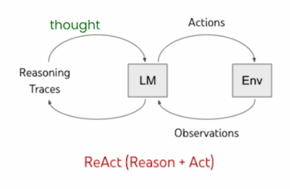
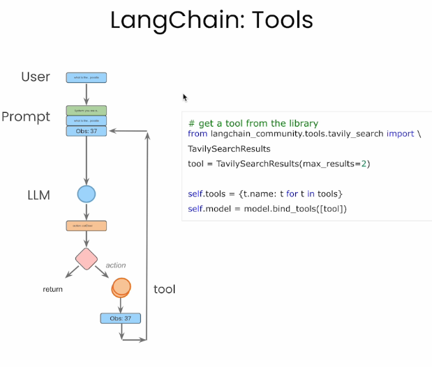
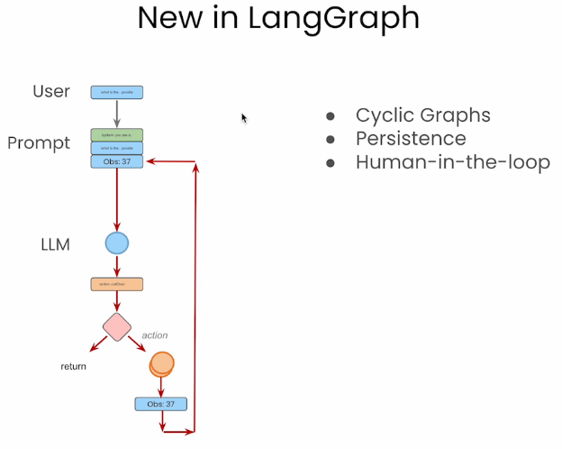
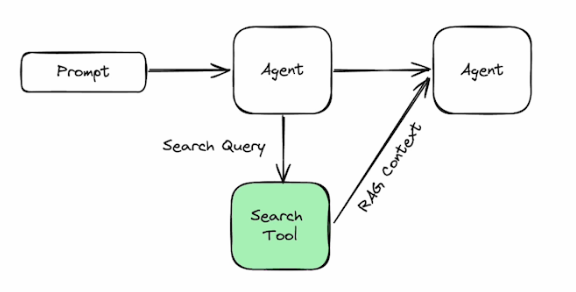
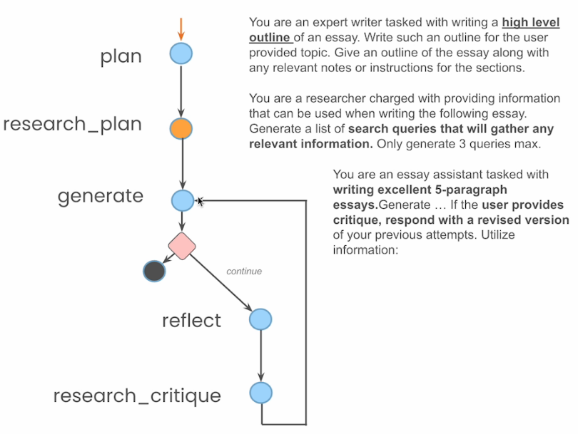

# 🤖 [AI Agents in LangGraph](https://www.deeplearning.ai/short-courses/ai-agents-in-langgraph/)

💡 Welcome to the "AI Agents in LangGraph" course! The course will equip you with the knowledge and skills to build and enhance AI agents using the LangGraph extension of LangChain.

## Course Summary
In this course, you'll explore key principles of designing AI agents with LangGraph, learning how to build flow-based applications and enhance agent capabilities. Here's what you can expect to learn and experience:

1. 🛠️ **Building from Scratch**: Learn to build an agent from scratch using Python and an LLM, understanding the division of tasks between the LLM and the code around it.

2. 🔄 **LangGraph Implementation**: Rebuild your agent using LangGraph, learning about its components and how to combine them effectively.

3. 🔍 **Agentic Search**: Explore agentic search, which retrieves multiple answers in a predictable format, enhancing the agent’s built-in knowledge.

4. 💾 **Persistence**: Implement persistence in agents, enabling state management across multiple threads, conversation switching, and the ability to reload previous states.
5. 👥 **Human-in-the-Loop**: Incorporate human-in-the-loop into agent systems to ensure accuracy and reliability.
6. ✍️ **Essay Writing Agent**: Develop an agent for essay writing, replicating the workflow of a researcher to enhance productivity and quality.

By the end of the course, you’ll have hands-on experience with LangGraph’s core components and a solid understanding of how to build and enhance AI agents effectively.

## Key Points
- 🧩 Learn about LangGraph’s components and how they enable the development, debugging, and maintenance of AI agents.
- 📈 Integrate agentic search capabilities to enhance agent knowledge and performance.
- 🌟 Learn directly from LangChain founder Harrison Chase and Tavily founder Rotem Weiss.

## About the Instructors
🌟 **Harrison Chase** is the Co-Founder and CEO of LangChain, bringing extensive expertise in AI and agent systems to guide you through this course.

🌟 **Rotem Weiss** is the Co-founder and CEO of Tavily, specializing in AI agent design and implementation, to help you master the use of LangGraph.

🔗 To enroll in the course or for further information, visit [deeplearning.ai](https://www.deeplearning.ai/short-courses/).
