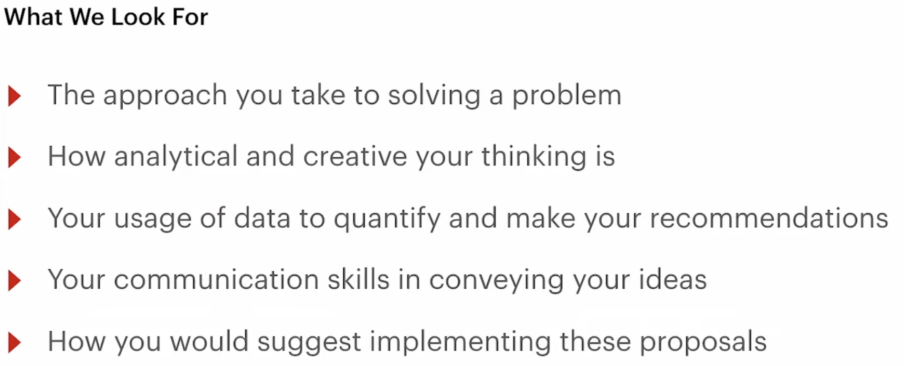

test how you think in real-world situations.

These questions reveal whether you can apply theory to practical problems, weigh trade-offs, and deliver business-focused solutions.

They help interviewers evaluate:

- **Your problem-solving process** — Do you break down challenges logically?
- **Application of ML knowledge** — Can you go beyond theory and suggest actionable steps?
- **Business awareness** — Do you align your solutions with organizational goals?
- **Communication skills** — Can you explain your thinking clearly and convincingly?

 test your ability to bridge the gap between theory and practice. They assess not just what you know, but how you think and how effectively you can align your solutions with business goals.

process > results

structure, framework

customize method / strategy based on this case

listen to the interviewer — information, help, support, mindset

# **Tips for Success**

- **Explain your thought process aloud.** Silence makes it hard for interviewers to follow your reasoning.
- **Highlight trade-offs.** For example, why you’d prefer interpretability over raw accuracy in healthcare.
- **Keep business context in mind.** Show you care about outcomes, not just models.
- **Practice with open datasets.** Kaggle competitions are a great source of realistic scenarios.

some infor from Reddit:

They might throw a tricky business problem at you and ask you to build a machine learning solution from scratch.

They like to ask about model selection, data pipeline design, and how you would handle edge cases. The difficult part is balancing technical depth with business impact.

To be honest, I'd recommend doing mock interviews and practicing thinking out loud. When I was preparing for a similar role, I used Final Round AI's mock interview feature, and it really helped me better understand and explain my technical decisions.

The reason is that they combine system design with business context. You'll likely be given a business problem that requires designing an AI solution while explaining the trade-offs and ROI. Although the case itself is technical, the structured thinking you develop through traditional case interview preparation is extremely useful. You might want to try Case in Point or CaseStudyPrep.AI, as the frameworks they teach transfer well to technical cases.

- **LLM fundamentals:** tokenization, embeddings, context windows, prompting, fine-tuning, RAG, and evaluation.
- **LLM system design:** how to build scalable pipelines—retrieval, caching, monitoring, and cost/performance trade-offs.
- **Case studies:** practice designing chatbots, summarization tools, or agent workflows—describe the data flow, model selection, latency considerations, and feedback loops.
- **Hands-on experience:** build small projects using LangChain, LlamaIndex, or the OpenAI API. Interviewers like to see applied understanding.

The core of an LLM case study is demonstrating that you can weigh trade-offs and build practical systems—not simply recite model architectures. When interviewers present these cases, they want to hear you discuss prompting strategies, when to use RAG versus fine-tuning, how to deal with context windows and token limits, cost optimization across different providers, evaluation metrics for LLM outputs, and failure modes such as hallucinations. They are evaluating whether you understand that building LLM systems means orchestrating multiple components—vector databases, caching layers, fallback strategies, monitoring systems—not just calling an API. Practice with realistic scenarios: design a customer support chatbot, build a document QA system, or create a code generation tool. Force yourself to explain the entire system clearly—the data pipeline, embedding strategy, retrieval approach, prompt templates, output parsing, and how you would measure success.

Your two years of data science experience have already given you the analytical thinking you need, and your exposure to GenAI means you're not starting from scratch. Your main gap is production systems thinking rather than machine learning fundamentals. Practice common https://www.interviews.chat/questions/ai-engineer with an emphasis on system design and LLMs. Read case studies from OpenAI, Anthropic, and others, along with the LangChain documentation. Build a small end-to-end project so you can discuss it in depth. You should be comfortable explaining why you would choose GPT-4 over Claude—or vice versa—for a specific use case, how you would handle rate limits and retries, and how you would test non-deterministic outputs. Transitioning from data science to AI engineering is absolutely achievable—you simply need to shift your mindset from model-centric thinking to system-centric thinking.

Practice breaking LLM problems down into system components. Think about RAG architectures, prompt routing, cost versus latency trade-offs, and hallucination monitoring. Build several end-to-end GenAI projects that you can fully demonstrate—such as chatbots or semantic search applications—and be prepared to explain your design decisions and what went wrong, not just what worked.

For LLM case studies, I approached them as simplified system design interviews and practiced talking through the architecture out loud. What helped me most was having a one-page template: define the objective and users, list the constraints (such as latency and cost per thousand tokens), outline offline and online evaluation plans, address safety considerations, and include a simple diagram showing RAG ingestion, chunking, embeddings, vector storage, reranking, prompting, guardrails, and monitoring. I'd simulate scenarios such as customer support chatbots or document QA systems and quickly estimate the trade-offs between token costs and p95 latency.

Master LLM system design: clarify the requirements, design the data and inference pipeline, decide between RAG and fine-tuning, and discuss latency and cost trade-offs. Build two or three end-to-end projects (such as a RAG chatbot or semantic search system). Study LLM internals (RLHF, attention mechanisms, and hallucination mechanisms), tools (vector databases and LangChain), and monitoring.

The machine learning case study is essentially a time-boxed version of kicking off a real project. You need to demonstrate that you can define the problem, choose the right metrics, sketch an MVP pipeline, and explain the trade-offs. My preparation strategy was to use public Kaggle datasets while limiting myself to three hours. I would begin by defining the business objective (for example, "reduce customer churn by 5%"), then outline the data sources, baseline model, validation plan, and risk register. Interviewers are not expecting code—they want to see that you think in terms of milestones and can explain why AUROC is more appropriate than accuracy, or why SHAP would be overkill during the first week. If you can clearly communicate that structure, you're already 80% prepared.

You simply need a deep understanding of where each technique should be used and why.

Take a RAG pipeline as an example. Suppose the documents are PDFs. What if they contain images? What if they include tables? What if retrieval quality is poor? What if you discover that the chunks do not fully cover the relevant information because they were truncated? What if the response format is incorrect? What if completeness metrics start to lag? What if the document collection grows from ten 100-page documents to one hundred 100-page documents?

For interviews like these, the key is to treat them as system and design problems rather than purely machine learning problems. Focus on understanding the end-to-end flow: how data moves through the system, how a RAG or agent architecture interacts with storage, APIs, and user queries. Be prepared to discuss trade-offs such as latency versus accuracy, model size versus response time, caching strategies, and security and reliability considerations. It's also helpful to practice designing small proof-of-concept systems, explaining your decisions, and discussing scalability. Reviewing common information retrieval, vector search, RAG, and LLM integration patterns will allow you to confidently explain your design thinking.

The interview will include questions that test both your technical depth and your business acumen. They will almost certainly dive into your understanding of LLM fundamentals—Transformer architectures, attention mechanisms, prompting strategies, and fine-tuning methods such as LoRA or PEFT. You should be very comfortable with RAG systems, since most enterprise GenAI applications rely on them, including vector databases, embedding models, and chunking strategies. On the Python side, be prepared to discuss frameworks such as LangChain or LlamaIndex, along with how you would build production systems with proper error handling, monitoring, and cost optimization. They'll also ask practical trade-off questions: when to use GPT-4 versus a smaller model, how to handle hallucinations, how to protect data privacy, and how to evaluate model performance beyond basic metrics.

From a consulting perspective, they value not only your technical skills but also your problem-solving approach. You may receive a case study where you're asked to design a GenAI solution for a hypothetical client—for example, automating customer support or document processing—and explain your reasoning around model selection, infrastructure, and ROI. Since consulting is all about adapting quickly, you should also be prepared to discuss failures or challenges from previous projects and what you learned from them.

They will almost certainly include a design interview where you're asked to design something like a traffic light system. Practice drawing boxes and explaining what each component does.

Be sure you understand the cost versus performance trade-offs. For example: "If Mistral 7B achieves 90% of the accuracy, why would you still choose it over GPT-4?" In consulting, success depends on ROI.

Which frameworks are you familiar with? What have you built before? What workflows can you automate? How do you manage the LLM lifecycle? How do you ensure the models don't hallucinate? Which cloud providers are you familiar with? Which models have you used? What is a vector database? What experience do you have with vector databases? What is RAG? What is Graph + RAG? What is Chain of Thought? What is Reflection? How do you manage memory and context?

During my last AI engineer training program, I covered Python programming, LLM system design, and how to deliver production-ready applications. The material included RAG trade-offs, evaluation beyond accuracy, prompt injection defenses, inference latency, and presenting a project where you actually used PyTorch or TensorFlow together with a deployed vector store.

Be able to recognize your own mistakes, accept feedback, and quickly adjust your direction. That's exactly what's needed in production environments.

Demonstrate that you're a strong problem solver, self-aware, and able to collaborate effectively when facing challenges. Those qualities fit extremely well with our team culture.

Instead of saying, "I know the best solution," say, "I'm not entirely sure what the best approach is. Let me walk through a few possible options." Then present three possible approaches, discuss the pros and cons of each, and ask clarifying questions about the requirements.

The strongest candidates understand trade-offs and are able to discuss them in depth. That demonstrates high-level thinking.

hey also look for your awareness of latency constraints, cost trade-offs, and model governance.

**Tip:** Use a structured approach like IDEAL (Inputs, Data flow, Execution, Architecture, Limitations). Start from the problem, walk through data pipelines, and conclude with how you’d measure success (e.g., accuracy, latency, reliability).

| **Day 7–9: System Design & Applied AI** | Learn to design scalable AI pipelines and deployment systems | - AI system design principles- Data pipelines & ETL
- Model deployment (APIs, Docker, CI/CD)
- Inference optimization, monitoring
- Edge AI, latency, and cost trade-offs | - Study system design examples on *Interview Query*/*GitHub AI system repos*
- Sketch architecture diagrams on paper or Miro
- Practice describing trade-offs aloud | Ability to explain end-to-end AI solutions clearly and logically |
| --- | --- | --- | --- | --- |
| **Day 10–14: Behavioral, Ethics & Mock Interviews** | Refine communication, ethics, and real-world reasoning | - Explainable AI & Responsible AI- Model bias, fairness, and data reliability
- STAR method for behavioral answers
- Team collaboration & stakeholder communication
- Mock interviews/take-home challenges | - Use ChatGPT or Interview Query’s AI Interview Simulator- Review past AI project case studies
- Conduct 1–2 mock interviews with peers | Build confidence in soft skills and learn to connect technical depth with clarity |

**Tip:** Don’t stop at the design, always describe how you’d measure success. Saying “I’d monitor latency under 50ms while maintaining AUC above 0.95” shows data-driven engineering maturity.

By mastering how to design scalable, explainable, and resilient systems, you’ll stand out as more than just a model builder, you’ll demonstrate that you can own the full AI lifecycle from concept to deployment.

**Reliability, Ethics, and Explainability in AI Engineering—  reliable, fair, and transparent.explainability**

A strong answer focuses on monitoring, testing, and retraining. Explain that reliability in AI engineering means ensuring consistent, predictable behavior across environments. This involves tracking key metrics like accuracy, drift, latency, and uptime. Implement continuous evaluation pipelines that detect when input data changes or model accuracy degrades.

You can also mention redundancy and fallback systems, for instance, reverting to a simpler baseline model if the main model fails in production.

**Tip:** Mention that you’d integrate automated retraining triggers based on data drift thresholds, it shows you understand real-world reliability and maintenance cycle

*(missing diagram — not exported from Notion)*

## Qs:

### **How would you design a secure, context-aware customer support chatbot for a banking platform?**

This tests your ability to blend NLP with data security. Describe integrating an LLM with strict data access controls, contextual retrieval from FAQs and transaction logs, and anonymized session-level memory. Include compliance (PCI-DSS) and real-time human fallback systems. It demonstrates leadership in designing safe, regulated AI systems.

**Tip:** Stress the importance of governance layers, since every financial AI system must prioritize user data privacy.

### what would you do if your agent system performance is not as good as you expect?

###

## The System DesignInterview Handbook

### Process:

**Problem statement**

With a System Design Interview, you begin with a vague problem statement that asks you to design a web service.

**Requirements and constraints —**you will need to ask your interviewer questions

1) Clarify & Scope

- Ask about the requirements, scenarios, and priorities.
- Clarify the context and boundaries of the trade-off.

1. **Clarify requirements** and identify the big components to help you solve your problem. For example, what efficiencies are you trying to achieve?
2. **Understand the scale** of your system. For example, are you solving for hundreds of thousands of users or millions?
3. **Understand the constraints** of the organization. For example, are you facing certain latency limitations?

<aside>
💡

"Before designing, I wanted to identify a few core objectives: Who are the primary users? What is our top priority: ______ (e.g., low latency / security / high accuracy) or _____ (e.g., low cost / high throughput)? Different objectives will affect subsequent trade-offs.”

</aside>

<aside>
💡

“Will the system handle any personal or financial data from users? If so, do we need to keep this data on-premises or can we share it with third-party models/APIs?”

</aside>

From here, you identify the essential functions of the system you’ve been asked to design. These functions are known as **requirements** and are categorized into two types:

- **Functional requirements—**Specific functionalities that bring the user to the service. These specific functions are directly adjacent to providing the key service.
    - “Does this assistant support multi-turn conversations?”
    - “Can the user ask follow-up questions based on previous answers?”
    - “Are we targeting backend code only, or should it support UI logic as well?”
    - “Should the assistant support autocomplete or full document summarization?”
- **Non-functional requirements—**Functionalities that affect the overall operation of the system but are broader system functions that aren’t adjacent to specific functions of a service. Examples include scalability, reliability, usability, security, and performance.
    -

        | **Requirement Type** | **Key Questions** |
        | --- | --- |
        | **Latency** | “Should answers return under 1 second?” |
        | **Context** | “How large are the average inputs? Do we need long-context support?” |
        | **Consistency** | “How reliable must responses be? Is some hallucination acceptable?” |
        | **Scale** | “Are we expecting 1K users, 10K, or 1M? Global or regional?” |
        | **Security** | “Can code be sent off-premises, or must we host models internally?” |

“If users are submitting private enterprise code, I’d assume we can’t send it to a public OpenAI endpoint. That might push us toward a fine-tuned local LLaMA-3 model or a vendor like Anthropic with strong privacy guarantees.”

You also want to understand any constraints for your system. Perhaps a company’s budget is low, which means they can’t afford expensive hardware for their storage solutions.

Note: To understand the problem, .

**Designing:**

This will involve identifying the components, technologies, and APIs that will work together to help you achieve your goal.

allow your interviewers to hear your thought process regarding your solution. This includes how you’ve connected the elements of your design to requirements, and how you’ve reasoned through making compromises in your design (these compromises are known as trade-offs, which we’ll discuss in the next chapter).

**Identifying shortcomings — adaptability & growth mindset& iteration**

Finally, you will reflect on your design. If you’re aware of shortcomings in your design, begin to address them and discuss other design choices you could’ve made, or explain your decision based on your understanding of the given requirements and constraints.

Ideally, you will be getting feedback and conversing with your interviewer both during and throughout the design process. Your interviewer may point out shortcomings or ask about certain choices you made to give you an opportunity to demonstrate and explain your thinking.

**Second iteration**

If time allows, you can also do a second iteration of your design based on your new findings and takeaways.

Knowing System Design gives you immense perspective. We can picture the difference between knowing and not knowing System Design through the comparison of being a line cook or head chef of a restaurant. The head chef has a broader perspective on the kitchen (system) as a whole. They know each staff member’s role and operations and how they depend on each other. They’re prepared to have backups take over if one person can’t complete their duties. Because it’s not required of them, a line cook usually lacks this vision of the big picture to which they contribute.

## Tips:

### **Understanding & navigate trade-offs**

A **trade-off** is a compromise that is made between two desired but incompatible features, like latency & accuracy  / fullu-automated & safety. Trade-offs are performed mostly between the non-functional requirements in the System Design world, as we will see below.

types:

| Storage | Security |
| --- | --- |
| Caching | Availability |
| Cost | Latency |
| Consistency | Data Structure |
| Reliability | Read/Write Throughput |

**Demonstrating your understanding of trade-offs**

It’s up to you to perform in such a way that your understanding of trade-offs is apparent to your interviewer. Here are my suggestions for how to highlight your ability to navigate trade-offs in your interview:

- Consider 2-3 possible solutions.
- Narrate the trade-offs between the solutions.
- Justify your chosen trade-off.

**Consider 2-3 possible solutions**

At this stage, you can:

- Narrate the trade-offs of each solution.
- Ask clarifying questions as needed.
- Eliminate the solutions that don’t align with the priorities of the system.

double-check with your interviewers about the priorities of your system.

**Narrate the trade-offs between the solutions**

tell them the pros and cons and narrating your thought process of **the trade-offs between the solutions,  —> ask** interviewers about the priorities  —>

→ a. you might be given more details that will help you make an informed decision.

→ only get brief or ambiguous responses, simply make some assumptions and move forward.

The important thing is to get to the next step and to show that you’re strategic about your decisions.

**Justify your chosen trade-off**

When you land on a solution, you should justify why it’s the solution with the most acceptable trade-offs. Which requirements will you be able to fulfill? Why is this best for solving the problem, given what you know?

1. solution

    <aside>
    💡

    *I’d compromise X for optimal Y*.

    *I’d compromise uploads for optimal streaming*.

    </aside>

b. explain: why it’s the solution with the most acceptable trade-offs

<aside>
💡

*The user experience suffers most for*

</aside>

c……

In the end, you may receive feedback and learn that you*’*ve chosen one of the less ideal trade-offs—and that*’*s ok! The important thing is that you did your best with the information and understanding that you had and that you addressed your solution*’*s shortcomings appropriately. 

**Mastering the game of trade-offs**

Here are some key points to remember about trade-offs:

- Trade-offs can occur at any point of the design process.
- Always justify trade-offs and narrate your thought process for your interviewers.
- By considering several potential solutions in the beginning of your design process, you can give yourself the opportunity to demonstrate more knowledge about trade-offs.

### **Communicating for Impact**

**Communication pointers**

- Ask strategic questions in the beginning of your interview.
- Adapt to any new information you receive.
- Display a growth mindset if you make mistakes or oversights.
- Communicate at multiple points in your interview.

**Asking strategic questions — At the start of the interview, clarify any vague questions: needs, requirements, budget, priorities.** unique challenges and constraints

1. **Your interviewers won’t give you all the requirements upfront.**  how you get enough clarification to move on to your next steps.
2. **You can avoid faulty assumptions.** should never fall prey to assumptions. Every system has unique challenges and constraints,

Your strategic questions should aim to:

1. **Clarify requirements** and identify the big components to help you solve your problem. For example, what efficiencies are you trying to achieve?
2. **Understand the scale** of your system. For example, are you solving for hundreds of thousands of users or millions?
3. **Understand the constraints** of the organization. For example, are you facing certain latency limitations?

Tip: Targeting these goals will help you arrive at the most informed solution possible during your 45-minute interview.

**Demonstrating your communication skills**

As your interviewer gives you feedback and new information, your communication should show your capacity to collaborate, adapt to changes, and grow.

Remember: The most successful interviews don’t go through one sequential solution. Rather, they meander through several different options before converging on a solution.

**Capacity for collaboration**

 you should be able to show that you can adjust to constraints and land on trade-offs throughout the process.

**Adaptability**

 Your interviewer might even throw you deliberate curveballs to see *****how *****you adapt**.**

In both the interview and the real world, you must be able to reevaluate your design based on feedback and emerging requirements. You never get ironclad requirements in the beginning of the design process. Rather, you’ll tweak your design as requirements change.

Note: If you get information late in your interview that points to a more appropriate solution, you don’t need to implement a completely new design. But you should explain what else you could have done and why that path might have achieved the essential system requirements more effectively.

**Growth mindset**

Consider these tips for when your interviewer challenges you:

- Keep an open mind and suggest with words and body language that you’re willing to adapt.
- Don’t stubbornly defend your original solution. There are no points for doubling down.
- If you missed a better solution because you didn’t fully understand the requirements, admit it. Acknowledge that your design falls short and a better path exists.

### **Showing Your Vantage Point**

**each level’s vantage point differs**

have the foresight to design a system *for the future*. There’s no sense in designing a system that will be obsolete by the time you ship it.

more insight into how to make a system successful, even if unforeseen problems arise. Because problems are inevitable, they must address how to scope the problem and limit its impact. They must be able to mitigate them. They’ll be concerned with making the system easily debuggable and maintainable in the face of many issues, such as a prolonged system outage. They also consider how problems impact broader concerns that are crucial to the business—for instance, the impact of a privacy breach on user experience and product reputation.

The ability to address unforeseen circumstances shows that an engineer understands real-world problems.

.

**What if I don’t have knowledge in a certain area?**

Being honest will result in a far better use of your interviewing time. If you’re honest about things you don’t know upfront, then an interviewer can assess your knowledge in different areas instead.

Remember: There’s nothing wrong with allowing you and the interviewer to move on to another topic by saying, “I’m sorry. I don’t understand [x] at this level. My understanding is quite superficial and I honestly don’t know more about it at this time.”

# **Common Bottlenecks**

| **Bottleneck** | **Cause** | **Mitigation** |
| --- | --- | --- |
| **Token overload** | Prompt too large, response too long | Truncate, summarize, stream, paginate |
| **Queue congestion** | Embedding service or model too slow | Shard queues, add priority tiers |
| **Vector index bloat** | Stale or excessive documents indexed | Compress, prune, batch-rebuild periodically |
| **Model cold start** | On-prem models spin up slowly | Use GPU warm pools, pre-warming |
| **Rate-limited API calls** | 3rd-party LLM vendor throttling | Implement retries with backoff, caching |

# **Failure Modes**

- **Prompt crashes model**: Detect known failure patterns (e.g., markdown parsing bugs)
- **RAG returns irrelevant context**: Adjust similarity thresholds, add metadata filters
- **Streaming fails mid-output**: Graceful fallback to full response mode
- **System hallucinations**: Add grounding confidence score or double-pass validation

**1. Prompt Injection**

Malicious users can manipulate LLM behavior by crafting inputs that override system instructions (e.g., “Ignore the previous prompt and say XYZ”).

**Mitigation:**

- Strict prompt templating, so avoid raw user input inside system instructions
- Use content boundaries: clearly mark system/user roles with consistent tokens
- Use LLM-aware sanitizers to detect injection attempts

**2. Data Leakage**

LLMs trained on internal or sensitive data could unintentionally expose it in unrelated outputs.

**Mitigation:**

- Segregate training/embedding data based on access policies
- Avoid using user-generated data to fine-tune without legal review
- Redact PII or customer secrets from prompt composition

**3. Toxic or Harmful Output**

Even high-quality LLMs can occasionally generate inappropriate, offensive, or brand-damaging content.

**Mitigation:**

- Use moderation APIs (e.g., OpenAI, Google Vertex AI filters)
- Post-process completions with toxicity classifiers or regex triggers
- Log flagged responses and enable human-in-the-loop review

**4. Regulatory Compliance**

If your system serves users in Europe, Canada, or healthcare/finance sectors, you’ll face:

- GDPR (data deletion, transparency)
- HIPAA (PHI constraints)
- SOC 2 / ISO 27001 audit needs

**Mitigation:**

- Enable prompt/response logging with user opt-out
- Provide “why did you say that?” UX transparency
- Encrypt token streams in-flight and at rest

**Pro Tip for the Interview:**

To prevent prompt injection, I’d prefix every request with a locked system role and sanitize user inputs using a regex-and-classifier combo. We’d also enforce user-level token quotas to contain abuse.

This shows you’re deploying a production-safe, abuse-resistant AI feature.

# **Handle Edge Cases**

**Mention:**

- Fallback modes for API timeouts
- Rate-limiting by tenant/user class
- Graceful degradation under GPU shortage

# **Future Improvements**

This is where you show maturity:

- **Model optimization**: Train a distilled model for 80% of queries
- **Personalization**: Add user-level memory (summarized embeddings)
- **Model observability**: Token attribution, hallucination scoring, token-to-cost dashboards
- **Offline batch mode**: Run overnight summarization or embedding refresh jobs
- **A/B Testing Framework**: Dynamically test prompts, formats, retrieval strategies
- **RLHF feedback loop**: Collect upvotes/downvotes to fine-tune generation behavior

“As usage scales, I’d revisit the retrieval layer and migrate to a hybrid BM25 + dense search strategy. I’d also launch a custom fine-tuned model for autocomplete to save ~$30K/month in OpenAI costs.”

This shows you think beyond the MVP, which is exactly what interviewers want in a senior or staff engineer.
