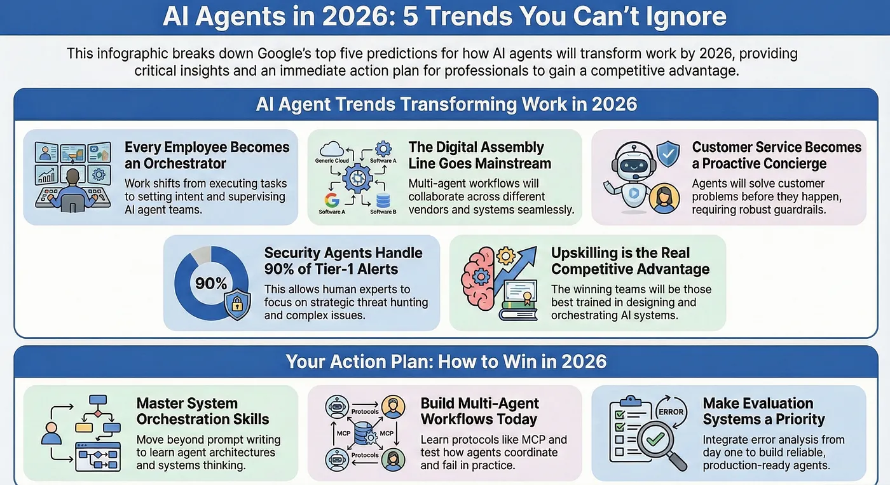
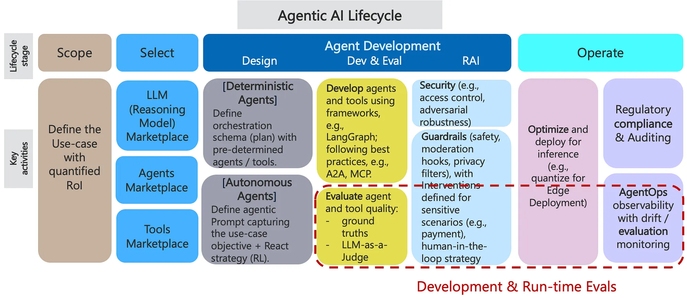

# Reading List & Prep Materials

Salvaged from the Notion `table_of_contents.md` dump: topic checklist, curated links, and book list. Job-application tracker references kept for context.

## Topic checklist + materials (original head)

A DB for tracking application: Job Application Tracker

Ings:

Case Interview

RAG

RL

Agent

Context Management

Memory management

**Harness Engineering - designing systems around model intelligence**

for cost & latency

General infor

Context Engineering

Traceability / Observability

Evals

Other topics need to do research:

Safety / reliability & failure modes / **Error Handling and Recovery**

Loop Engineering

Knowledge Graph

Tool Calling and Evals

**Recovery / roll back**

Some materials:

https://weaviate.io/ebooks/advanced-rag-techniques

https://github.com/KalyanKS-NLP/LLM-Interview-Questions-and-Answers-Hub

https://roadmap.sh/ai-engineer

https://roadmap.sh/ai-agents

https://github.com/shareAI-lab/learn-claude-code

https://cheatsheetseries.owasp.org/cheatsheets/AI_Agent_Security_Cheat_Sheet.html

https://cheatsheetseries.owasp.org/cheatsheets/LLM_Prompt_Injection_Prevention_Cheat_Sheet.html

Sth to read (but Yan haven’t):

from https://martinfowler.com/articles/reliable-llm-bayer.html?ref=dailydev

https://docs.langchain.com/oss/python/deepagents/overview?ref=blog.langchain.com

https://docs.langchain.com/oss/python/concepts/products

todos

Job Application Tracker

https://www.revarta.com/compare/chatgpt

K/V caching, the under-the-hood mechanism behind prompt caching, and semantic caching

## Link dump (original tail)

-

    https://github.com/Shubhamsaboo/awesome-llm-apps/

- Introduction to Agents whitepaper
- https://medium.com/data-science-collective/ai-agents-complete-course-f226aa4550a1
- https://gerred.github.io/building-an-agentic-system/index.html
- https://www.amazon.in/Engineering-Bible-Up-Date-Production-ebook/dp/B0F4KZJN6Z
- https://www.amazon.com/dp/B0G2BCQQJY
- https://www.amazon.co.uk/dp/1098118731?crid=V2ANC8CMW9TX&keywords=The+Staff+Engineer%27s+Path&sprefix=the+staff+engineer%27s+path,aps,229&language=en_US&dib_tag=se&ref_=as_li_ss_tl&dib=eyJ2IjoiMSJ9.Ce1SzKnc3Sb5-pmrQqWRASiiHSwXA7JkAQ0a6fSin5nK-3CcrCRM3A_hOYJYRB-qhiJWiBt5e6QvIv39DSe3fbM5EUMEZ07xFbr_3wutSIN9PcIY44GGFZy2GwM1tSk71qYweGbHdZbBB3Jb5jv3TKhpTVenz1PZGkG_mHIw8oH39a7cjBGFZlZ55DsUlrGB.GbGdOZr2Jc97LbXbvUI8kc-y9xFy9Jr1NE6Hb4feEWA&sr=8-1&linkCode=gg2&linkId=ce74f51fa227cf5d34ec53de23b20d78&tag=gratitudedriv-20
- https://www.amazon.co.uk/dp/109816220X?crid=938LUKPWO8YE&keywords=The+Developer%27s+Playbook+for+Large+Language+Model+Security&sprefix=the+developer%27s+playbook+for+large+language+model+security,aps,158&language=en_US&nsdOptOutParam=true&dib_tag=se&ref_=as_li_ss_tl&dib=eyJ2IjoiMSJ9.ALaBXEsHb7r1sF0yqAbWVUVzl3_P_XXls7mpDH2mKJbeib4XKSqm_pcRKUapJZlm.GZAm0YcRH7x2_mlylc9OB1K8usb6YapQQvNtiXXBIIQ&sr=8-1&linkCode=gg2&linkId=d2453f7f6236359b3f387360ea1864e2&tag=gratitudedriv-20
- https://www.amazon.co.uk/dp/B0FN37DV9N?crid=2BUJADE7GU2LS&keywords=Generative+AI+Design+Patterns&sprefix=generative+ai+design+patterns,aps,191&language=en_US&dib_tag=se&ref_=as_li_ss_tl&dib=eyJ2IjoiMSJ9.LoXliv3Bs3rhlwVtRutymTw9Qo1lnSCEquZYREnhybDuSgX852ELmc0UiiuAOBMS0tusHZOcyqOi22JaksVGhc_-CjvnpTOPsamdMFytv7AUNn3L1K5erWFXei4u8MdJ8b_kLYbD9e4js2YI5QEUvCipBYZVqlQf0jc9Lbd6e2FN0TphF5z7qrzj8wZ46JtNNpmONqwBjlkiDTt76dy-QtVUjGS-XgOQUHyzUvjgSLE.NTZLA1bMo-6-pE9yru0e3TRlejAaXVCrL_aT3xqFL5s&sr=8-1&linkCode=gg2&linkId=03b9f2adce25f9007832372640602fab&tag=gratitudedriv-20
- https://www.amazon.co.uk/dp/0674729013?crid=1H3T009KROHH4&keywords=make+it+stick+the+science+of+successful+learning&sprefix=Make+It+Stick:+The+Science+of+Successful+Learning,aps,191&language=en_US&nsdOptOutParam=true&dib_tag=se&ref_=as_li_ss_tl&dib=eyJ2IjoiMSJ9.8vb44HdBfTn_568ldh4jMkQyTGMCPzQy4v1h9fQdGsQ2dh7mc1k1frUxzJFKWW5V4HaKmFDB3AGV6QjItWqbsaDIZ9Fv0HcK-ovVeEL57sDxEFLCMFS6BFxCsUZOFdT2PzH4G-iduvQsAII9YzIipunxstq7jK23o-DlMw4kfmB-cYf1PFtecMpRhvT-EgF-o_5dVCu9U6n5oGg-x9l7yfximM_veLwR4yXVcgbo4sw.Rl-tYpyFcQfznfByygQQsXNarPvfryaLNYd6nJS-a0E&sr=8-1&linkCode=gg2&linkId=a56e353ab86285c9941e50472feca41c&tag=gratitudedriv-20
- ETL pipeline: https://rivery.io/data-learning-center/etl-pipeline-python/
-

## Unplaced diagrams (images/ has them, original position unknown)

- 
- 
